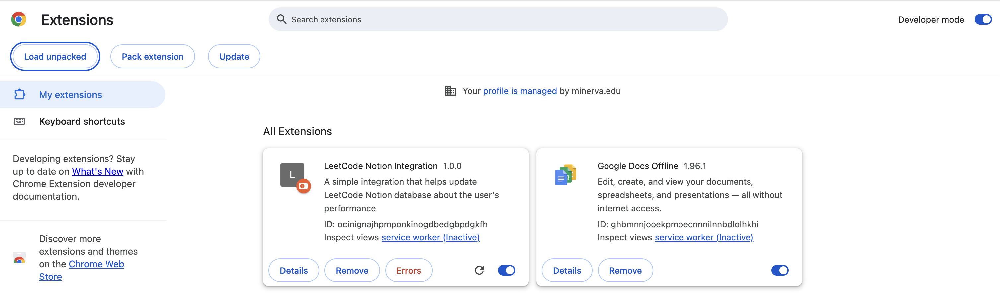

# Notion-LeetCode Chrome Extension

A Chrome extension and backend server to seamlessly track your LeetCode problem-solving progress in Notion—no more manual copy-pasting!

---

## ✨ Features

- Start a timer for any LeetCode problem directly from Chrome.
- Automatically record problem name, difficulty, topic, time spent, and your code in a Notion data source.
- Track multiple review attempts and durations.
- Works with the latest Notion data source API.

---

## 🗂️ Project Structure

- **extension/**: Chrome Extension logic and UI (side panel, popup, content scripts)
- **server/**: Node.js backend server (handles Notion API integration)

---

## 🚦 Requirements

1. **Google Chrome**  
   The extension is a side panel and only works on Google Chrome. Other browsers (like Arc) are not supported.
2. **Node.js & npm**  
   Required to run the backend server.
3. **Notion Integration**
   - You must create a Notion integration and obtain an internal integration secret (API Key).
   - The integration must have access to your Notion data source (see below).
4. **Notion Data Source ID**
   - You must use the **data source ID** (not the old database ID) for your Notion table.

---

## 🔗 Setup & Installation

### 1. Create a Notion Integration

- Follow this [tutorial](https://developers.notion.com/docs/create-a-notion-integration) to create your integration.
- Copy the generated API key.

### 2. Share Your Notion Data Source

- Open your Notion data source (table).
- Click the ••• menu at the top right, choose **Add connections**, and add your integration.

### 3. Get Your Data Source ID

- Open your data source in Notion.
- Copy the ID from the URL (see [Notion docs](https://developers.notion.com/docs/upgrade-guide-2025-09-03) for details).
- **Note:** Make sure you are using the data source ID, not the database ID.
  

### 4. Configure the `.env` File

Create a `.env` file in the `server` directory with the following content:

```
NOTION_KEY={your-api-key}
NOTION_DATASOURCE_ID={your-datasource-id}
```

---

## 🧩 Load and Unpack the Chrome Extension

1. Go to `chrome://extensions/` in Chrome.
2. Enable **Developer mode** (top right).
3. Click **Load unpacked** and select the `extension` folder.
4. The extension icon should appear in your Chrome toolbar.
   

---

## 🚀 Running the App

1. **Install dependencies:**  
   Open a terminal, navigate to the `server` directory, and run:
   ```
   npm install
   ```
2. **Start the backend server:**
   ```
   npm start
   ```
   or
   ```
   node server.js
   ```
3. **Use the extension:**
   - Visit a LeetCode problem page.
   - Open the extension from the side panel.
   - Start the timer, solve the problem, and click `Solved`—your data will be sent to Notion!

---

## 📝 References

- [Notion API Reference](https://developers.notion.com/reference/intro)
- [Notion Data Source Upgrade Guide](https://developers.notion.com/docs/upgrade-guide-2025-09-03)
- [Google Chrome Side Panel](https://developer.chrome.com/docs/extensions/reference/api/sidePanel)

## 💡 Tips

- Make sure your Notion integration has access to the data source.
- Use the correct data source ID (not the old database ID).
- If you encounter issues, check the server logs for error messages.

---

Enjoy seamless LeetCode tracking in Notion!
